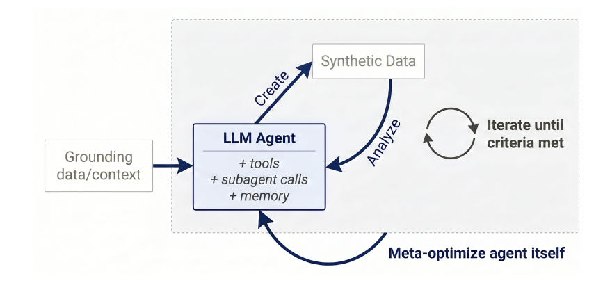
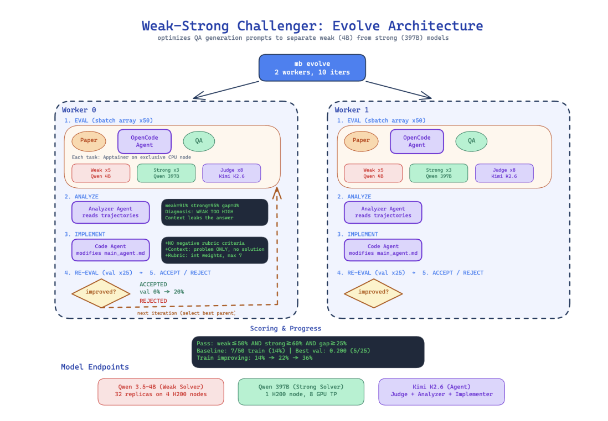
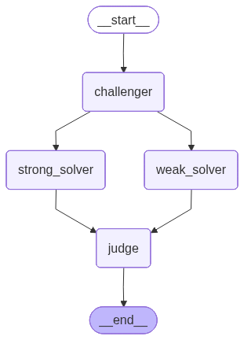
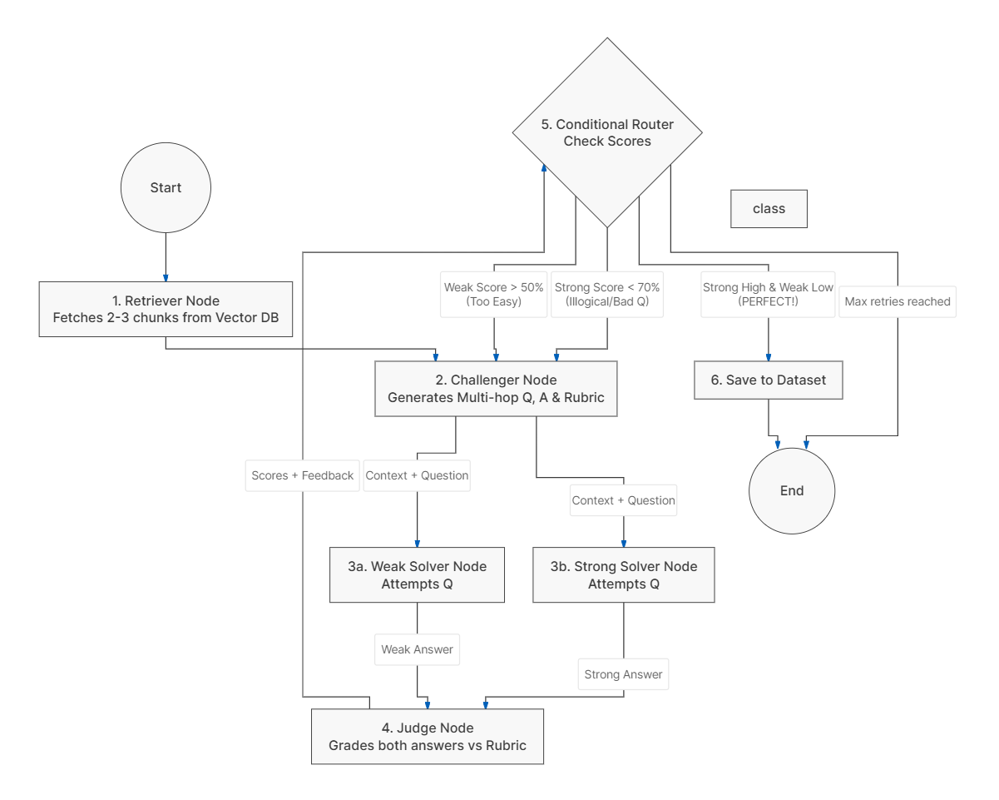

<div align="center">

# 🧪 AutoData — Agentic RAG-Instruct Pipeline

### *Autonomous Synthetic Data Generation for LLM Fine-Tuning*

[](https://python.org)
[](https://langchain-ai.github.io/langgraph/)
[](https://ollama.com)
[](https://smith.langchain.com)

*An adversarial multi-agent system that autonomously generates high-quality, multi-hop reasoning QA datasets — inspired by Meta FAIR's "Autodata" research paper.*

---

</div>

## 📖 What is AutoData?

AutoData is a **multi-agent LangGraph pipeline** that acts as an autonomous AI Data Scientist. Instead of manually crafting training data, AutoData uses an adversarial **Challenger → Solver → Judge** loop to automatically generate complex, multi-hop reasoning question-answer pairs from any document corpus.

The generated datasets can be used to:
- 🎯 **Fine-tune LLMs** (like Llama, Gemma) for better reasoning capabilities
- 📊 **Evaluate RAG pipelines** with adversarial, multi-hop questions
- 🧠 **Benchmark model intelligence** by testing weak vs. strong model performance gaps

---

## 🔬 Research Paper Reference

This project is inspired by **Meta FAIR's** research paper:

> **"Autodata: An Agentic Data Scientist to Create High Quality Synthetic Data"**
> *Meta Fundamental AI Research (FAIR)*

### Core Concept from the Paper

The paper proposes treating synthetic data creation as an **iterative data-science loop** — not just a one-shot generation task. An LLM agent creates data, evaluates its learning utility, analyzes failures, and revises its strategy. The key innovation is the **Weak-Strong Challenger architecture** that tunes data difficulty by exploiting the performance gap between a small (weak) and large (strong) model.

<div align="center">



*Fig 1: The Agentic Self-Instruct concept — An LLM Agent creates synthetic data, analyzes its quality, and iterates until criteria are met. (Source: Meta FAIR Paper)*

</div>

### How the Paper's Architecture Looks

The paper uses a **Main Agent** that orchestrates a **Challenger LLM**, **Strong Solver**, **Weak Solver**, and a **Verifier/Judge** — all working together in a feedback loop to produce high-quality training data.

<div align="center">


*Fig 2: The reference architecture from the paper — Main Agent coordinates with Challenger, Strong/Weak Solvers, and a Verifier/Judge. (Source: Meta FAIR Paper)*

</div>

### The Evolve Architecture — Weak-Strong Challenger

The paper's most powerful concept is the **Evolve Architecture**, where multiple workers iteratively optimize QA generation prompts to maximize the performance gap between a weak (4B) and strong (397B) model. Each iteration involves evaluation, analysis, implementation of prompt changes, and re-evaluation.

<div align="center">



*Fig 3: The IDLE (Iterative Data-science Loop Evolution) architecture. Workers run eval batches, analyze trajectories, modify prompts, and re-evaluate — accepting or rejecting changes based on whether the weak-strong gap improved. (Source: Meta FAIR Paper)*

</div>

---

## 🏗️ Our Implementation

We adapted the paper's concepts into a practical, locally-runnable LangGraph pipeline. Here's how our implementation maps to the paper:

| Paper Concept | Our Implementation |
|---|---|
| Main Agent + Challenger LLM | `challenger_node()` — Generates multi-hop Q, A, and Rubric |
| Weak Solver (Qwen 4B) | `weak_solver_node()` — Llama 3.1 8B (via Ollama) |
| Strong Solver (Qwen 397B) | `strong_solver_node()` — Gemma 4 27B (via Ollama) |
| Verifier / Judge (Kimi K2.6) | `judge_node()` — Grades both answers against rubric |
| Iterative Feedback Loop | LangGraph conditional routing with `route_after_judge()` |
| Grounding Data / Context | ChromaDB vector store with local embeddings |

### Our Compiled LangGraph

This is the actual compiled graph that LangGraph produces from our code:

<div align="center">



*Fig 4: The compiled LangGraph — `__start__` → `challenger` → parallel fan-out to `strong_solver` & `weak_solver` → fan-in to `judge` → conditional routing back to `challenger` or `__end__`.*

</div>

### Detailed Workflow Flowchart

Here's a detailed flowchart showing every step of the pipeline, including the conditional routing logic:

<div align="center">



*Fig 5: Complete workflow — From document retrieval through Challenger question generation, parallel solving, Judge evaluation, to conditional routing decisions (Too Easy / Illogical / Perfect / Max Retries).*

</div>

---

## ⚙️ How It Works — Step by Step

```
📄 Your Documents (PDF/TXT)
        │
        ▼
┌─────────────────────────┐
│  1. VECTOR STORE SETUP  │  ChromaDB + FastEmbed (local embeddings)
│     get_vector_store()  │  Chunks docs into 500-char pieces
└──────────┬──────────────┘
           ▼
┌─────────────────────────┐
│  2. TOPIC EXTRACTION    │  LLM reads sample chunks
│     extract_topics()    │  Returns 3-5 core topics dynamically
└──────────┬──────────────┘
           ▼
┌─────────────────────────┐
│  3. CONTEXT RETRIEVAL   │  For each topic:
│     similarity_search() │  Fetch top-2 relevant chunks from ChromaDB
└──────────┬──────────────┘
           ▼
    ┌──────────────┐
    │  LANGGRAPH   │◄────────────────────────────────┐
    │    LOOP      │                                  │
    └──────┬───────┘                                  │
           ▼                                          │
┌─────────────────────────┐                           │
│  4. CHALLENGER AGENT    │  Generates multi-hop      │
│     challenger_node()   │  Question + Answer +      │
│                         │  Grading Rubric           │
└──────────┬──────────────┘                           │
           ▼                                          │
   ┌───────┴────────┐  (Parallel Execution)           │
   ▼                ▼                                 │
┌────────┐   ┌──────────┐                             │
│ WEAK   │   │ STRONG   │  Both attempt the           │
│ SOLVER │   │ SOLVER   │  same question               │
│ (8B)   │   │ (27B)    │  independently              │
└───┬────┘   └────┬─────┘                             │
    └──────┬──────┘  (Fan-in)                         │
           ▼                                          │
┌─────────────────────────┐                           │
│  5. JUDGE AGENT         │  Grades BOTH answers      │
│     judge_node()        │  against the rubric       │
│                         │  → weak_score, strong_score│
└──────────┬──────────────┘                           │
           ▼                                          │
┌─────────────────────────┐                           │
│  6. ROUTER              │                           │
│  route_after_judge()    │                           │
│                         │                           │
│  ✅ Strong≥70 & Weak≤50 │──→ END (Save QA pair!)   │
│  🔁 Weak > 50           │──→ Loop (Too Easy)────────┤
│  🔁 Strong < 70         │──→ Loop (Illogical)───────┤
│  💀 Max retries (5)     │──→ END (Discard)          │
└─────────────────────────┘                           │
```

---

## 📁 Project Structure

```
AutoData/
├── main.py                     # 🚀 Entry point — orchestrates everything
├── requirements.txt            # 📦 Python dependencies
├── .env                        # 🔑 API keys (LangSmith, etc.)
│
├── src/
│   ├── __init__.py
│   ├── config.py               # ⚙️ Model names, DB paths, settings
│   │
│   ├── agents/
│   │   ├── __init__.py
│   │   ├── challenger.py       # 🎯 Generates multi-hop Q/A/Rubric
│   │   ├── solvers.py          # 🤖 Weak & Strong solver nodes
│   │   └── judge.py            # ⚖️ Grades answers against rubric
│   │
│   ├── graph/
│   │   ├── __init__.py
│   │   ├── state.py            # 📋 AutoDataState (TypedDict schema)
│   │   └── graph.py            # 🔗 Builds & compiles the LangGraph
│   │
│   ├── rag/
│   │   ├── __init__.py
│   │   └── vector_store.py     # 🗄️ ChromaDB + document chunking
│   │
│   └── utils/
│       ├── __init__.py
│       └── prompts.py          # 💬 System prompts for all agents
│
├── data/                       # 📄 Put your PDF/TXT files here
├── output/                     # 💾 Generated dataset + graph image
├── chroma_db/                  # 🗃️ Auto-generated vector database
└── metadata/                   # 🖼️ Research paper screenshots & diagrams
```

---

## 🚀 Quick Start

### Prerequisites

- **Python 3.10+**
- **Ollama** running locally with models pulled

### 1. Install Dependencies

```bash
pip install -r requirements.txt
pip install langchain-ollama langsmith
```

### 2. Pull Ollama Models

```bash
# Weak Solver (small model — should struggle with multi-hop)
ollama pull llama3.1:latest

# Strong Solver + Challenger + Judge (large model — should excel)
ollama pull gemma4:27b
```

### 3. Add Your Documents

Place your PDF or TXT files in the `data/` folder:

```bash
AutoData/
└── data/
    ├── research_paper.pdf
    ├── article.txt
    └── documentation.pdf
```

### 4. Configure Environment (Optional — for LangSmith)

Create a `.env` file:

```env
LANGSMITH_API_KEY=ls-your_key_here
LANGSMITH_PROJECT=AutoData-RAG-Instruct
```

### 5. Run the Pipeline

```bash
python main.py
```

### 6. View the Graph (Without Running Pipeline)

```bash
python -m src.graph.graph
# Saves graph image to output/graph_diagram.png
```

---

## 📊 Output Format

The pipeline generates `output/synthetic_dataset.json`:

```json
[
    {
        "topic": "Synthetic data generation vs. human-written data",
        "context": "Chunk A text... --- Chunk B text...",
        "question": "How does the iterative feedback loop in Agentic Self-Instruct differ from standard synthetic data generation?",
        "reference_answer": "Unlike standard approaches that generate data in one shot...",
        "strong_answer": "The iterative loop specifically uses weak-strong solver gaps to...",
        "rubric": [
            {"criterion": "Identifies the iterative loop mechanism", "weight": 4},
            {"criterion": "Mentions weak-strong solver behavior", "weight": 3},
            {"criterion": "Penalize vague answers", "weight": -3}
        ],
        "scores": {
            "weak_score": 25.0,
            "strong_score": 85.0
        }
    }
]
```

---

## 🔍 LangSmith Tracing

When configured, every function in the pipeline is **fully traceable** via LangSmith:

| Agent | LangSmith Trace Name | What It Captures |
|-------|---------------------|------------------|
| Challenger | `Challenger Agent` | Generated question, answer, rubric |
| Weak Solver | `Weak Solver Agent` | Input context + question, output answer |
| Strong Solver | `Strong Solver Agent` | Input context + question, output answer |
| Judge | `Judge Agent` | Both evaluations, scores, feedback |

All LLM calls, state transitions, and routing decisions are logged with full input/output for debugging and analysis.

---

## 🔧 Configuration

All configurable settings are in [`src/config.py`](src/config.py):

| Setting | Default | Description |
|---------|---------|-------------|
| `WEAK_MODEL` | `llama3.1:latest` | Ollama model for weak solver |
| `STRONG_MODEL` | `gemma4:31b-cloud` | Ollama model for strong solver + judge + challenger |
| `MAX_RETRIES` | `5` | Max refinement loops per topic |
| `CHUNK_SIZE` | `500` | Characters per document chunk |
| `CHUNK_OVERLAP` | `50` | Overlap between chunks |

---

## 🧠 Key Design Decisions

1. **Why Adversarial?** — Simple QA generation produces easy questions. By forcing a performance gap between weak and strong models, we ensure questions require genuine multi-hop reasoning.

2. **Why Local Models?** — No API rate limits, no cost, full privacy. The weak-strong gap comes from model size difference (8B vs 27B), not from API differences.

3. **Why Dynamic Topic Extraction?** — Instead of hardcoding topics, an LLM reads the actual documents and discovers what topics would make good multi-hop questions. This makes the pipeline domain-agnostic.

4. **Why Store Strong Answers?** — Sometimes the strong model generates answers that are better than the reference answer from the Challenger. Both are preserved in the output for flexibility during fine-tuning.

---

## 📚 References

- **Paper:** [Autodata: An Agentic Data Scientist to Create High Quality Synthetic Data](https://ai.meta.com/research/) — Meta FAIR
- **Framework:** [LangGraph Documentation](https://langchain-ai.github.io/langgraph/)
- **LLM Runtime:** [Ollama](https://ollama.com)
- **Vector Store:** [ChromaDB](https://www.trychroma.com/)
- **Tracing:** [LangSmith](https://smith.langchain.com)

---

<div align="center">

*Built with ❤️ & ☕ using LangGraph, Ollama, and the spirit of Meta's Autodata research.*

</div>
